# 🚀 AI Market Intelligence Engine

A portfolio-level AI system designed to transform raw business data into **actionable market insights, risk analysis, and executive-level decisions**.

This project goes beyond traditional dashboards by combining:
- 📊 Data visualisation
- 🤖 Multi-agent AI analysis
- 🧠 Decision intelligence systems

---

## 🌐 Live Demo
👉 *(https://ai-market-intelligence-engine-kizeofskyus32x92mucvlp.streamlit.app/)*

---
# System Architecture

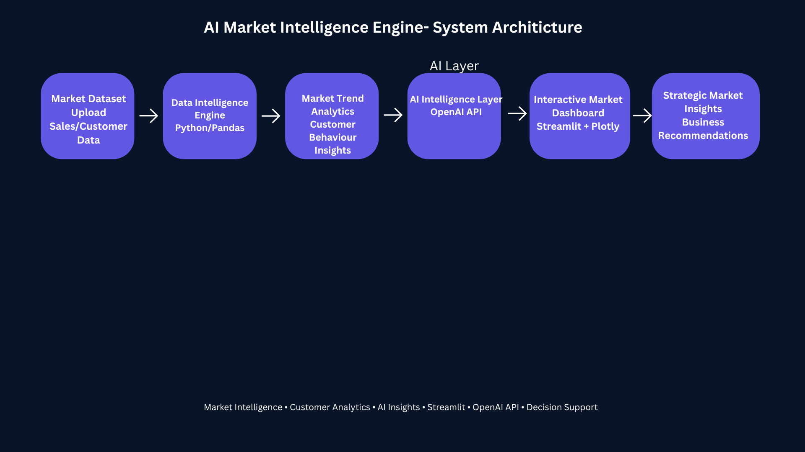
---
# Business Impact

This project demonstrates how AI-powered market intelligence systems can support:

- Customer behaviour analysis
- Market trend identification
- Strategic business insights
- AI-assisted analytics
- Commercial intelligence workflows
- Decision-support systems

The platform combines analytics pipelines, AI-generated insights, and interactive dashboards to simulate modern AI-driven market intelligence environments.
---
## 🎯 Project Overview

The **AI Market Intelligence Engine** is built to simulate how modern organisations use AI to:
- Understand market trends
- Identify risks and inefficiencies
- Discover growth opportunities
- Make data-driven business decisions

Unlike traditional BI dashboards, this system introduces a **multi-agent intelligence layer** and a **decision engine**, making it closer to a real-world AI product.

---

## ⚙️ Key Features

### 📊 Executive Dashboard
- Real-time dataset overview
- KPI metrics (records, features, missing values)
- Clean, product-style layout

---

### 📈 Market Intelligence Visuals
- Market distribution analysis (pie charts)
- Segment comparison (bar charts)
- Customer behaviour patterns (histograms & scatter plots)
- Full dataset-driven insights (not limited by filters)

---

### 🎯 Segment Performance Analysis
- Compare business metrics across segments
- Identify high-performing customer groups
- Supports decision-making for targeting and optimisation

---
🧭 Strategic Decision Recommendations

Provides executive-level strategic guidance by analysing dominant customer and market segments.

Key capabilities include:

Identification of high-value customer or market segments
Executive-level opportunity analysis
Revenue concentration risk assessment
Strategic business recommendations
Data-driven decision support
Revenue optimisation insights

This feature extends traditional business intelligence by transforming analytical findings into actionable business guidance for managers and decision-makers.

---
🧭 Strategic Decision Recommendations
The system automatically identifies dominant customer or market segments and generates executive-level recommendations, growth opportunities, risk assessments, and business actions.

---

### 🤖 Multi-Agent AI Intelligence

Simulates 3 AI roles:

- **Market Analyst**
  - Trends
  - Customer behaviour
  - Revenue insights

- **Risk Analyst**
  - Key risks
  - Warning signals
  - Data limitations

- **Strategy Advisor**
  - Growth opportunities
  - Strategic recommendations
  - Next best actions

---

### 🧠 Decision Intelligence Engine

Transforms insights into **clear business decisions**:

- Final decision
- Decision rationale
- Confidence score
- Priority level
- Business impact (revenue, customers, operations)
- Risk evaluation
- Action plan (Immediate / 30-day / 90-day)

---

## 🖼️ Screenshots

### 📊 Dashboard Overview
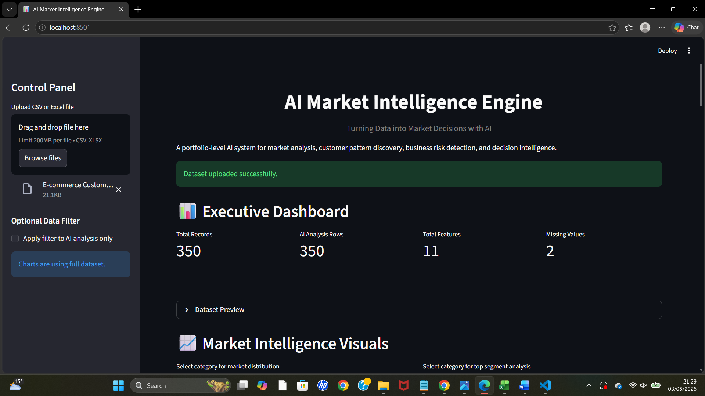

---

### 📈 Market Distribution & Segments
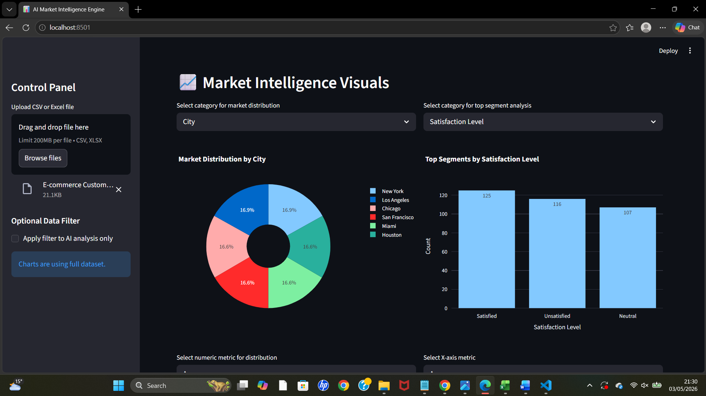

---

### 📉 Customer Distribution Analysis
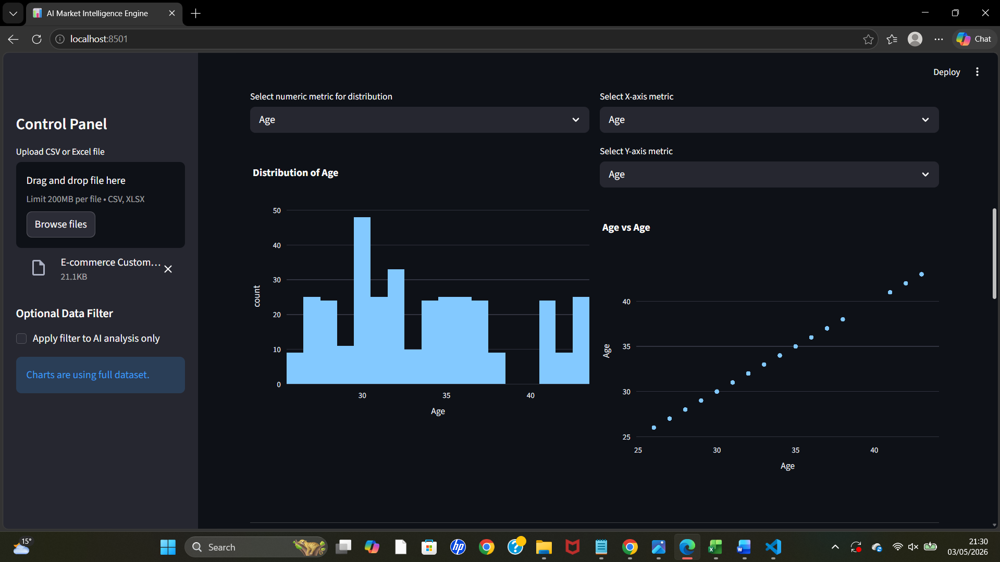

---

### 🎯 Segment Performance
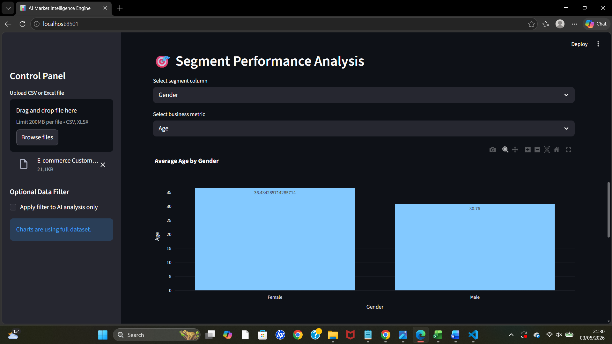

---

### 📋 Dataset Summary
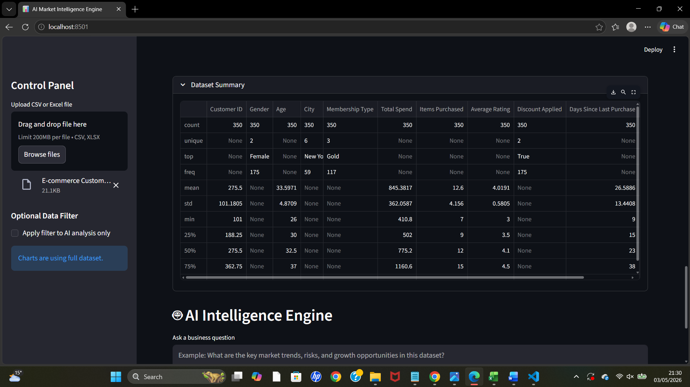

---

### 🤖 AI Input Interface
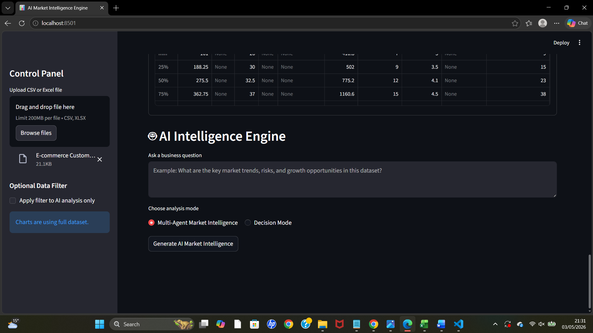

---

### 🧠 Multi-Agent Intelligence Report
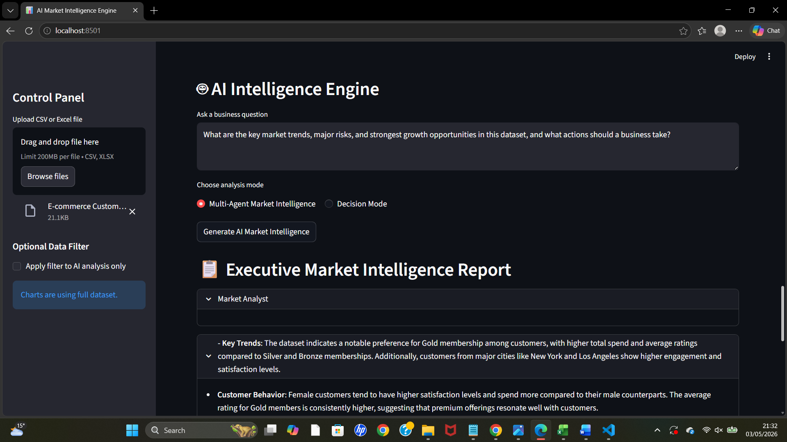

---

### 📊 Detailed Insights
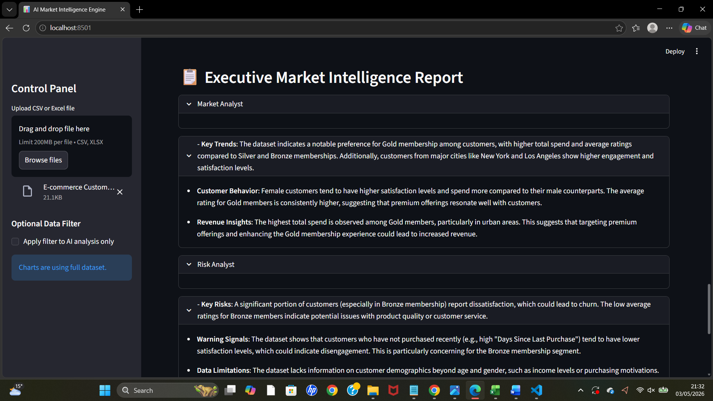

---

### 🚀 Strategy Recommendations
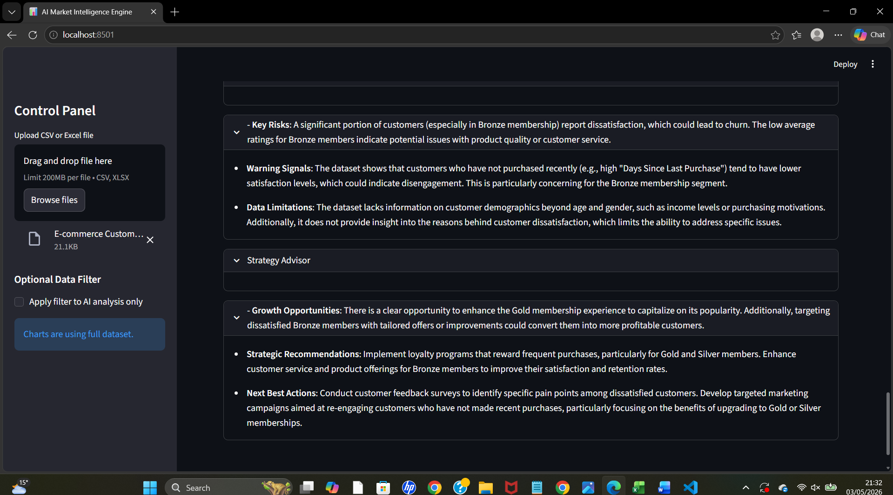

---

### 🧠 Decision Intelligence
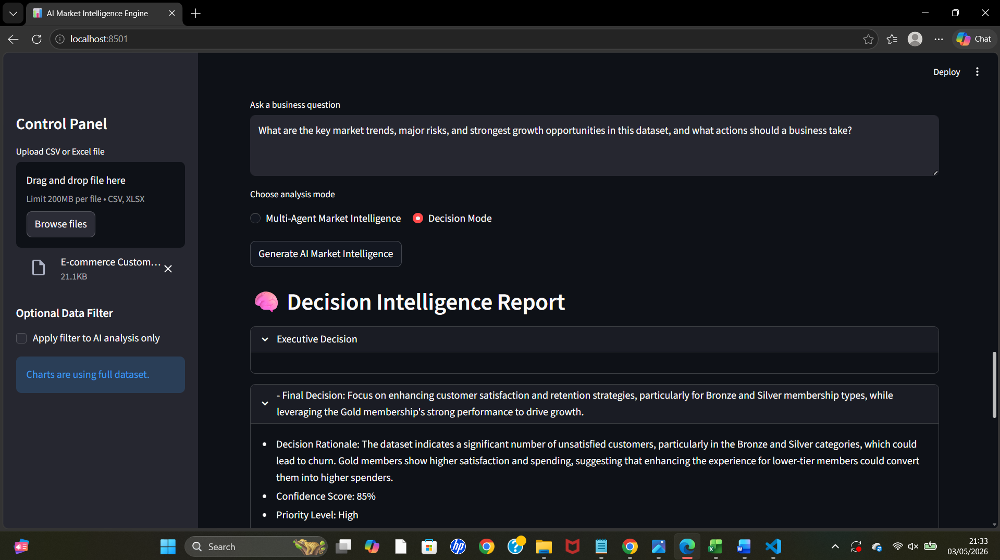

---

### 📊 Business Impact Analysis
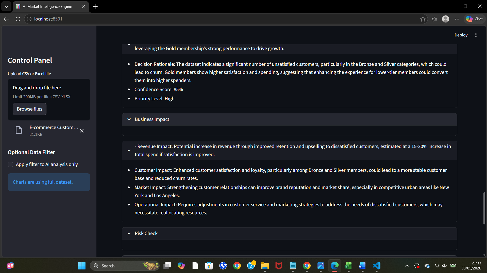

---

### ⚠️ Risk & Action Plan
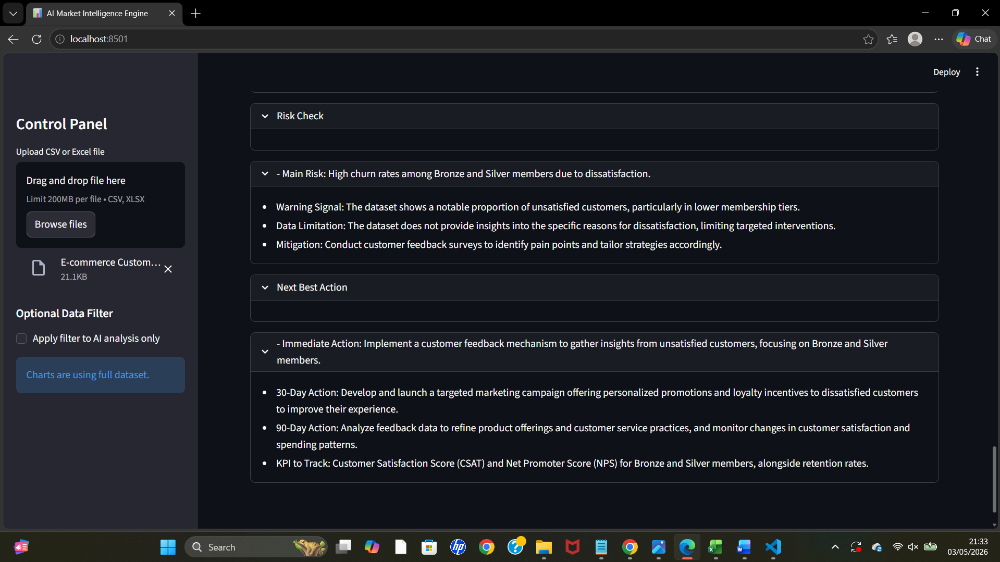

---

## 🛠️ Tech Stack

- **Python**
- **Streamlit**
- **Pandas**
- **Plotly**
- **OpenAI API (GPT-4o-mini)**

---

## ⚡ How It Works

1. Upload a CSV or Excel dataset
2. Explore data through interactive visualisations
3. Ask a business question
4. Choose:
   - Multi-Agent Intelligence
   - Decision Mode
5. Receive structured, executive-level output

---

## 💡 Example Use Cases

- Market trend analysis
- Customer segmentation
- Revenue optimisation
- Risk identification
- Business decision support

---

## 🚧 Challenges & Learnings

- Handling real-world dataset variability
- Designing meaningful visualisations (avoiding misleading insights)
- Structuring AI outputs for business users (not just raw text)
- Building a system that mimics **real decision workflows**, not just analytics

---

## 🔮 Future Improvements

## 🔮 Future Improvements

* Executive AI Summary with confidence scoring
* Automated insight detection (no manual question needed)
* Multi-agent collaboration workflows
* Integration with live data sources
* User authentication and role-based dashboards
* Advanced forecasting and predictive analytics
* AI-powered alerting and anomaly detection
* SaaS-level UI/UX enhancements
* Revenue optimisation recommendation engine
* Real-time market intelligence monitoring

---

## 🎯 Why This Project Matters

This project demonstrates:
- Applied AI in real business scenarios
- Transition from dashboards → decision systems
- Product thinking, not just technical implementation

It reflects how AI is evolving from:
**"data analysis tools" → "decision-making systems"**

---

## 👤 Author

**Kamran Khan**  
AI / Data / Business Intelligence Enthusiast  

---

## 📌 Notes

This project is part of a **3-project AI portfolio** focused on building real-world, decision-driven AI systems.
